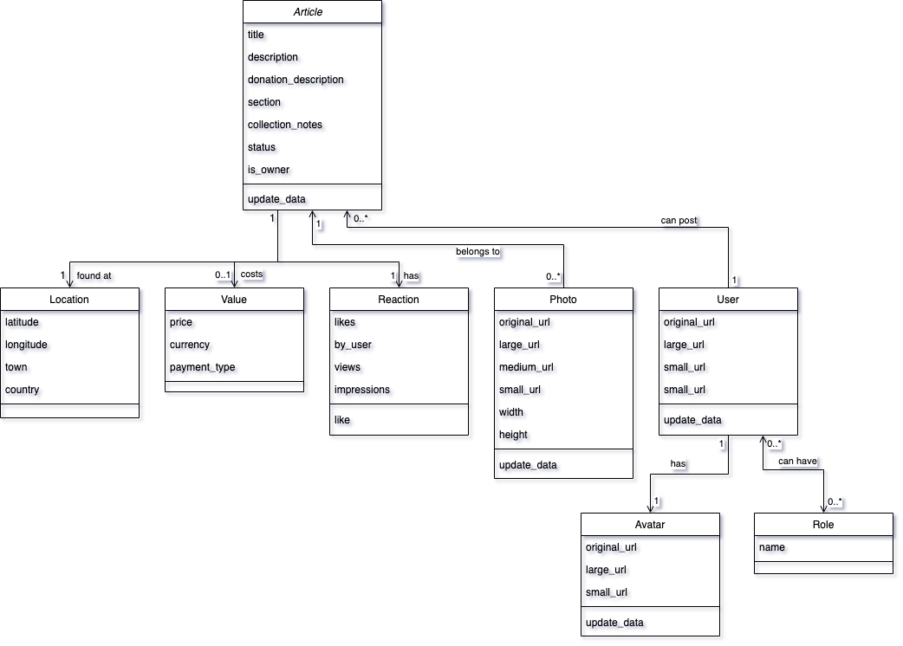

# Olio EX Ruby-On-Rails Coding Task
## Colin Currie

This README documents the Ruby-On-Rails coding task completed by [Colin](mailto:colin_currieself.hotmail.com) to demonstrate full-stack experience in building a simple website. The original task requirements can be found on the [Olio Ex](https://tech.olioex.com/rails-coding-task.html) website. This guide will explain how to start up the app in a local development environment. It will also describe some of the design considerations employed and hopefully give the reader a good understanding of the code and how to navigate it.

## Project details:

### Ruby version:
* ruby 3.1.2

### System dependencies
* Rails 7.0.4
* RSpec 3.12
* pg 1.4.5 (PostgreSQL 15.1)
* Dotenv 2.8.1

### Database Set Up

This rails app uses a PostreSQL database which will need to be set up before running the app or the test suite. If you do not have PostgreSQL installed this can be done simply with the following commands:

On a Mac:

    brew install postgresql

On Windows use [this PostgreSQL installer](https://www.postgresql.org/download/windows/)

And setting up the database can be done by running the following commands:

    rails db:create
    rails db:migrate

### How to run the test suite

The project has an RSpec test suite which generates a code coverage report in the `spec/coverage` folder. The test suite can be run with the following command:

    rspec -f d spec

## Running the project

Run the app with the following command:

    rails server

And then visit [http://localhost:8000/articles](http://localhost:8000/articles) to view the page of articles.

## Project Status

### What the app demonstrates
The app provides a single articles view for the test data which is provided.
The look and feel tries to mimic the existing [Olio web app](https://web.olioex.com/articles) as closely as possible.
Data is loaded from the source data and persisted on each page request, with the exception of the likes which are taken from the persisted data model.
There are a total of 25 records in the source data, so these are served 10 articles at a time with navigation buttons under the articles list to view further pages.
Each article shows a picture of the item, the title of the article, the user who posted the item and the distance which is provided in the data and a like button.
There is a like button on each article allowing the viewer to like the item which updates the data model and reloads the page woth the updated like count on the correct page of articles.

### What the app does not demonstrate
I have not demonstrated a React front end, instead I have opted to create a standard rails front end using ERB HTML and CSS.
The front end could also be improved by adding responsive CSS styling making it more mobile friendly.
The implementation of the like button uses a simple GET endpoint which increases the likes in the persisted data model before reloading the page. I would like to improve this by implementing web sockets using ActionCable to prevent having to reload the page after hitting the like button.
I have put in place simple pagination buttons to prevent loading all the articles on a sigle page. I would like to implement infinite scrolling as a next step once I have successfully configured ActionCable to use web sockets.
The app does not have an article view page. I intended to implement a single article page which would be shown on clicking a n article from the result list.

## Project Code

The code is a standard Rails 7 project and is set out as such, the following files or folders have been added to produce the articles page:

- `app/stylesheets/articles.css` The CSS styling for the articles page
- `app/stylesheets/page.css` The CSS styling for the overall page layout (the fake header)
- `app/controllers/articles_controller.rb` The main controller that reads the source file, persists the data and serves it for the front end.
- `app/models/` All models based on the format of the data in the source feed, more details on each model below.
- `app/views/articles/index.html.erb` The overall layout of the atricle list including pagination.
- `app/views/articles/_list_article.html.erb` The partial used to render each individual article in the list.
- `app/views/layouts/_header.html.erb` The partial used to render the page header.
- `coverage/` The results from the code coverage report generated when running the test suite.
- `spec/models` The data model test specs one for each class in the data model.
- `spec/factories` Factory classes for generating test classes in the test suite.
- `spec/resuests/article_spec.rb` (WIP) The front end tests for the articles page.

### The Data Model

The data model consists of 7 classes defined by the structure of the [source data](https://s3-eu-west-1.amazonaws.com/olio-staging-images/developer/test-articles-v4.json). Some of the models in the source data such as `Conversation` have removed to reduce the complexity of the data model, the classes left are either used in the articles page or would be used in the intididual article paage which has not been implemented. The relationships can be seen in the following diagram:

The most of the models have an `update_data` method which accepts json in the format from the source data, and maps the fields to the correct attributes. The classes that do not have this have attributes that match the data so the default `update` method can be used to populate the data. The only other functionality is the like method on the `Reaction` class which is used to imcrement the likes from the like button.
